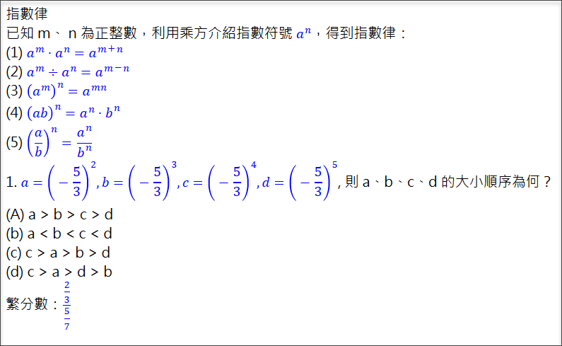

# AsciiMath 入門筆記（並與 MathType 比較）

**摘要**：本文是筆者個人初學 AsciiMath 所整理的筆記，其中還包含 AsciiMath 與 MathType 的比較。學習此工具的目的是為了編寫包含數學公式的教材與文件，供視障者使用，因此文中也會提及相關輔助工具，如：[NVDA](https://www.nvaccess.org/)、[Access8Math](https://addons.nvda-project.org/addons/access8math.en.html)、MathPlayer 等等。

## 簡介

AsciiMath 是一種用來撰寫數學公式的標記語言（markup language），雖然它比不上 LaTeX 那麼強大，但是 AsciiMath 語法相對簡單許多，容易上手，是一種方便編寫、也方便閱讀的語法。對於國中數學以及一些高中數學的公式，大致上也足以應付。

在我初次編寫數學文件的前期準備工作，我做了一些調查研究，目的是想了解 AsciiMath、LaTeX、和 MathType 三者的功能、優缺點，以及適用場合。我才剛開始使用 MathType，不算很有經驗，所以只能就我的粗淺了解來做個簡單的比較。單單以學習門檻來說，MathType 可以說是最好上手的，因為它提供了視覺化輸入工具，可以在 Word 裡面輸入數學公式，不需要使用者學習另一套數學公式的編排語法。其次是 AsciiMath，它有一套用來撰寫數學公式的語法，雖然不算太複雜，但還是有一定的學習門檻。最複雜的自然是 LaTeX 了，學習門檻是三者當中最高的，但是一旦熟悉了，便可應付任何複雜的數學公式和排版格式，說是無敵也不為過。

起初，我偏好 AsciiMath，因為它有兩大優點：

1. 有免費工具可用，不像 MathType 必須花錢購買。
2. 語法和工具都很容易上手，不像 LaTeX 那麼複雜。

只要懂一點 HTML，然後找一個好用的文字編輯器，就可以開始學習 AsciiMath 了。而且，一邊寫，還可以隨時用瀏覽器刷新網頁內容來便查看網頁呈現的數學公式，以確認自己輸入的語法是否正確。AsciiMath 官方網站的首頁也有快速入門的範例和語法表，只要花幾分鐘看一下，應該就能了解使用 AsciiMath 所編寫的數學公式大概長甚麼樣子。

AsciiMath 官方網站的網址是：http://asciimath.org/

## AsciiMath 語法有多簡單？

這裡提供幾個簡單的範例，以便快速了解 AsciiMath 語法的簡潔。為了方便視障朋友閱讀，這裡會盡量以日常口語的方式來描述，且一併列出 LaTeX 寫法，方便比較。

1. 線段 AB。AsciiMath 寫法是 `bar(AB)`，LaTeX 寫法是 `\overline{AB}`。
2. 分數：3 分之 2。AsciiMath 寫法是 `2/3`，LaTeX 寫法是 `\frac{2}{3}`。
3. 次方：2 的 3 次方。AsciiMath 寫法是 `2^3`，LaTeX 寫法也是 `2^3`。
4. x 的平方根。AsciiMath 寫法是 `sqrt(x)`，LaTeX 寫法是 `\sqrt{x}`。
5. 加總符號（sigma）：從 1 加到 10 的總和。AsciiMath 寫法是 `sum_(i=1)^10 i`，LaTeX 寫法是 `\sum\limits_{i=1}^{10}{i}`。

除了以上幾個簡單範例，AsciiMath 也能表現更複雜的數學公式和符號，例如交集、聯集等關係運算式，二元一次方程式、矩陣、微積分等等。

## 編輯流程與工具

AsciiMath 編輯流程大致如下：

1. 使用任何一套文字編輯器來編寫網頁的 HTML 內容，並且在需要插入數學公式的地方使用 AsciiMath 標記語法來編寫公式。
2. 編寫好 HTML 並且存檔之後，就可以用瀏覽器開啟這個 HTML 檔案，而瀏覽器在呈現網頁時，只要碰到 AsciiMath 數學標記，便會自動顯示成我們所熟悉的數學公式（而不會是我們輸入的標記語法）。如果視障者要閱讀這個網頁，電腦上面需要安裝 NVDA 和附加元件 Access8Math，NVDA 便可報讀網頁中的數學公式；若需要在點字顯示器也同時顯示數學點字，則必須安裝 MathPlayer 4.0。

以上描述的流程，需要搭配特定工具才能順利進行。具體來說，這個工具必須能夠將 AsciiMath 標記轉換成瀏覽器看得懂的數學標記，好讓瀏覽器能夠把數學公式「畫」出來。或者，這個工具能夠看懂 AsciiMath 語法，並且直接在網頁中把這些公式給畫出來。

根據 AsciiMath 官方網站首頁的說明，有兩種工具可以選擇：一個是使用 MathJax，另一個是使用 ASCIIMathML.js。

MathJax 是一套可以直接把網頁中的 AsciiMath 標記顯示成數學公式的 JavaScript 函式庫，它的優點是幾乎所有的瀏覽器都適用。它是 AsciiMath 官方網站建議採用的方案。

另一方面，ASCIIMathML.js 則是一個 JavasScript 檔案，它可以把 AsciiMath 標記（以及一些 LaTeX 標記）轉換成對應的 MathML 語法，然後再由瀏覽器來負責把 MathML 標記畫成我們熟悉的數學公式的樣子。MathML 是 HTML5 標準規格的其中一部份，專門用來描述數學公式的語法。也就是說，如果在編輯 HTML 的時候採用 ASCIIMathML.js（而不是 MathJax），那麼讀者在閱讀網頁時，瀏覽器必須支援 HTML5 和 MathML，才有辦法呈現數學公式。

筆者撰文當下，只有 Firefox 支援 MathML，而且即使採用 MathJax 來進行網頁的數學標記轉換，雖然 Firefox、Chrome 和 Edge 都可以正確顯示數學公式，但是搭配 NVDA 的時候，還是以 Firefox 的結果最佳。我測試了一個繁分數：分子是三分之二，分母是七分之五，結果 NVDA 搭配 Chrome 會先唸出「2357」，然後才唸出分數。Firefox 則無此現象。

除了上面提及的數學公式語法轉換工具，我們還需要一套好用的文字編輯軟體。我個人比較熟悉、而且推薦使用的是 Visual Studio Code、Atom，以及 Notepad++，這三套免費的編輯器都很好用。當然，Windows 內建的記事本也可以。

## 範例

底下是一份包含 AsciiMath 數學記號的 HTML 文件。從這個範例也可以看得出來，AsciiMath 的數學標記是用一對 \` 符號來表示（使用一般標準鍵盤來輸入時，就是 Esc 按鍵下方的那個按鍵）。

~~~~~~~~
<html>
<head>
<title>ASCIIMathML test suite</title>
<meta http-equiv="Content-Type" content="text/html; charset=utf-8">

</head>
<body>

    指數律  
    已知 m、 n 為正整數，利用乘方介紹指數符號 `a^n`，得到指數律： 
    (1) `a^m * a^n = a^(m+n)`  
    (2) `a^m -: a^n = a^(m-n)`  
    (3) `(a^m)^n = a^(mn)`  
    (4) `(ab)^n = a^n * b^n`  
    (5) `(a/b)^n = a^n/b^n`  

    1. `a=(-5/3)^2, b=(-5/3)^3, c=(-5/3)^4, d=(-5/3)^5`, 則 a、b、c、d 的大小順序為何？  
    (A) a > b > c > d  
    (b) a < b < c < d  
    (c) c > a > b > d  
    (d) c > a > d > b  

 
繁分數：`(2/3)/(5/7)`
    
</body>
</html>
~~~~~~~~

Firefox 呈現結果如下圖：

備註：我的軟體作業環境是 Windows 10、Office 2016、NVDA 2021.2 與附加元件 Access8Math 3.0、MathType 4.0。

## MathType 與 AsciiMath、LaTeX 的比較

大致了解 AsciiMath 並且做了一些簡單練習與測試之後，我到 NVDA 論壇發問，獲得一些前輩先進的寶貴意見。然後，我把這些意見和自己的粗淺經驗稍作整理如下：

- A 方案：Word+MathType，搭配 LaTeX 輔助，輸出結果主要為 Word 文件（可自行加工成為 HTML）。
- B 方案：AsciiMath 或單純的 LaTeX，輸出結果為 HTML。
 
以下從幾個不同面向來比較上述兩種方案：

1. 入門門檻：A 優於 B。
2. 編寫速度：B 優於 A（假設使用者已經熟悉相關語法）。
3. 軟體成本：B 優於 A。
4. 學生與老師雙向溝通：A 優於 B。
5. 是否可直接修改文件：A 優於 B。
6. 是否支援點顯器：皆可（需搭配 MathPlayer）
7. LaTeX 支援度：不確定，暫且視為二者相當。
8. 第三方工具支援：不確定，暫且視為二者相當。
 
兩種方案的共同交集：LaTeX 與 MathML。

## 結論
 
LaTeX 雖然語法比較複雜，但排版功能強大。如果需要製作大量的理科教材，LaTeX 是很值得花時間學習的技術。
 
最終，我還是選擇使用 MathType 搭配 Word 來編寫包含數學公式的文件，主要的考量，還是使用者的習慣，以及學生與老師的雙向溝通。未來若碰到比較簡單的數學公式，而且只需要閱讀網頁，那麼 AsciiMath 還是一個值得考慮的選項。

## 延伸閱讀

- [視覺障礙輔助科技筆記本](https://class.kh.edu.tw/19061/) 的 [MathML 專區](https://class.kh.edu.tw/19061/page/view/19)
- 討論串：[內含 MathML 標記的網頁，NVDA 碰到數學式子的時候會以中文來唸出數學式子嗎？](https://groups.io/g/nvda-tw/topic/mathml/85601902)
