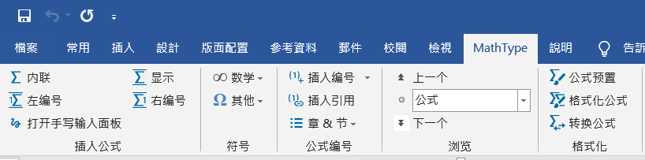
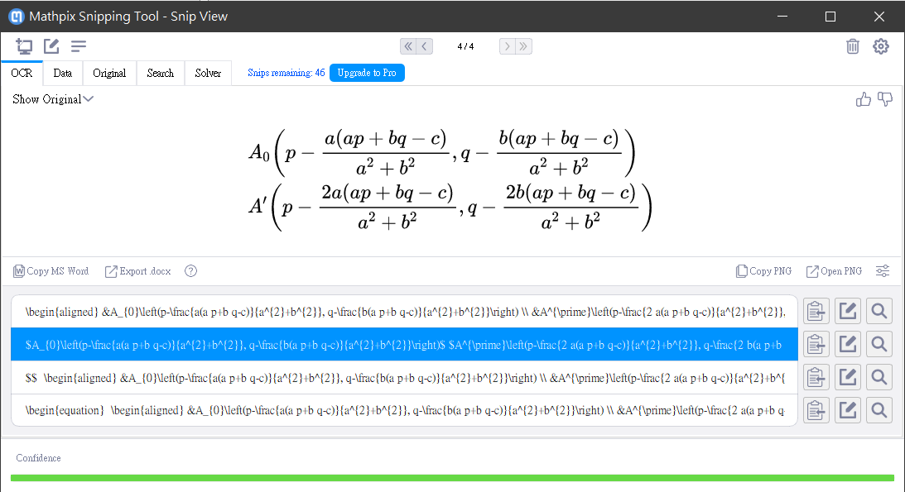
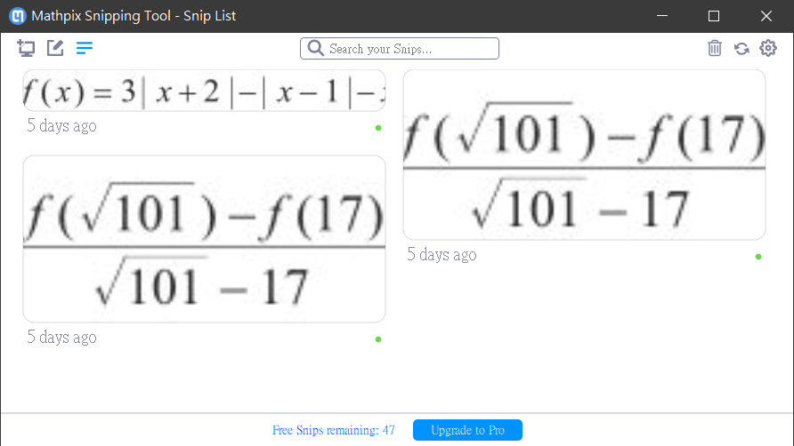
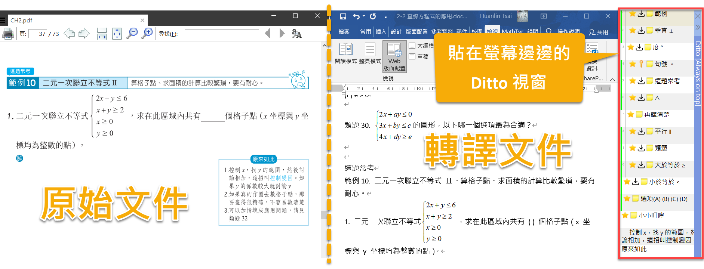
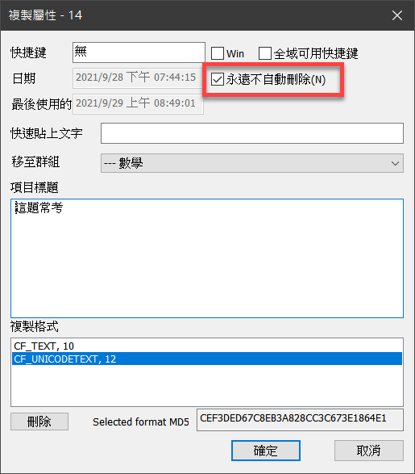
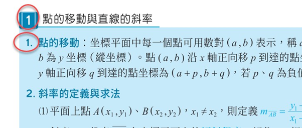
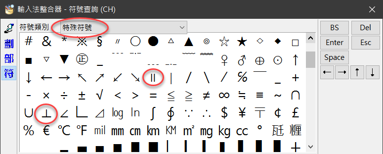
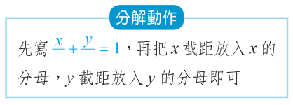

# 數學教材轉譯筆記

目標讀者：需要轉譯數學教材給視障生的人（此工作需要視覺）。

本文最後更新日期：2021.10.2

本文短網址：<https://bit.ly/MathBookRework> （歡迎轉貼分享，並註明來源出處）

**內容大綱：**

1. [前言](#前言)
2. [來源檔案格式](#來源檔案格式)
3. [相關工具](#相關工具)
    * [MathType 筆記](#MathType 筆記)（包含常用快速鍵列表）
    * [Mathpix Snip](#mathpix-snip)
    * [Ditto](#ditto)
4. [項目編號與符號](#項目編號與符號)
5. [小節標題的編號](#小節標題的編號)
6. [表格](#表格)
7. [特殊符號](#特殊符號)
8. [其他眉眉角角](#其他眉眉角角)
9. [從 DOCX 轉換成 HTML](#從DOCX轉換成HTML)
11. [結語](#結語)

## 前言

本文是筆者轉譯數學教材給視障生的個人心得筆記。寫這篇筆記時，我在這方面的經驗與背景知識還很貧乏，是個初學者。整理筆記的用意，是希望多一份文件，可供未來投入此工作的朋友參考，或許能夠省去一些自行摸索的時間。如有疏漏或謬誤之處，歡迎提出建議和指正，讓這份文件更加完善。

本文並不是完整的手冊或教學文件。如果您需要比較全面的了解視障數學教材編輯的流程與相關工具，可以先參考「視覺障礙輔助科技筆記本」網站上的 [MathML 專區](https://class.kh.edu.tw/19061/page/view/19)裡面的文章，裡面有許多寶藏。此外，底下有兩個 Youtube 影片，也推薦大家先看一下：

1. [數學教材轉譯實況（使用 MathType）](https://www.youtube.com/watch?v=wsYC1t4NDXI)。這是我製作的影片，長度約 11 分鐘。
2. [視障數學教材編輯 (視巡群組分享會)](https://www.youtube.com/watch?v=6FBsuVRm3g8)，主講人是黃偉豪老師。

底下是本文所提到的相關軟體的名稱與版本：

- Microsoft Office 2016
- WIRIS MathType 7.4.8.0
- Mathpix Snipping Tool 03.00.0048

## 來源檔案格式

來源檔案格式：DOCX 或 PDF。

PDF 的問題：有些中文字從 PDF 轉貼或轉存至純文字檔案時，會變成亂碼。而且，同一個檔案，有些文字可順利取出，有些則取出後變成亂碼，推測可能是製作 PDF 的時候，對某些文字使用了特殊的字元編碼。

基於上述原因，在進行教材轉譯工作時，如果來源檔案格式為 DOCX 檔案是最好的，可以省下一些枝枝節節的麻煩。然而，依教材出版商而定，還是難免碰到只有 PDF 檔案的情況。因此，轉譯工作者除了要熟悉 Word 文件的編輯功能，同時也要了解 PDF 檔案的一些特性與文件處理技巧。比如說，某些 PDF 可能是以圖片來呈現大量文字，此時便可能會需要使用螢幕擷取工具來將 PDF 文件中的某個區塊抓圖存檔，再丟給 Google 文件來進行文字辨識，以便取出其中的文字。

如果您有興趣了解數學教材的轉譯工作，想動手體驗看看，這裡有一個範例檔案可以下載回去做為練習或測試：[sample.pdf](https://github.com/huanlin/VisualAids/raw/main/MathML/%E6%95%B8%E5%AD%B8%E6%95%99%E6%9D%90%E8%BD%89%E8%AD%AF%E7%AD%86%E8%A8%98/sample.pdf)。

## 相關工具

本節整理我在進行轉譯工作時所用到的工具，有些是必備的，例如 MathType，有些則是可以提高生產力的輔助工具，例如自動辨識數學公式的 OCR 工具 Mathpix Snip，以及強大的剪貼簿管理工具 Ditto。

### MathType

這裡不會介紹 MathType 的詳細用法，僅記錄我在使用 MathType 時發現的一些心得與技巧。

1. 如上圖，MathType 工具列的左邊有「內聯」和「顯示」按鈕，這兩個按鈕都可以開啟 MathType 編輯器，二者的差異是：使用「內聯」所輸入的公式會與前後文字緊密結合，而使用「顯示」按鈕來輸入的數學公式則會自成單獨一列，與前後文字隔開。我最常使用的是「內聯」，快速鍵是 Ctrl+Alt+Q。
2. 在 MathType 編輯器當中輸入好公式之後，按 Ctrl+S 即可將公式傳送至 Word 文件中游標所在的位置，接著請按 Ctrl+F4 或以滑鼠點擊編輯視窗右上角的打叉按鈕來關閉 MathType 編輯器，而不要使用 Alt+F4 來關閉 MathType 編輯器。因為一旦使用 Alt+F4 來關閉編輯器，下次開啟 MathType 編輯器的時候，會如同第一次開啟編輯器時那樣需要等候一段比較長的時間。我錄製了一段影片，可以明顯看出兩種啟動速度的差異，影片連結：<https://youtu.be/I8LPvvt6vII>。
3. 使用 MathType 來輸入數學公式，最終無可避免地要學習一些 LaTeX 語法。所以必須知道 MathType 的一個快速鍵：Alt+\（即 Alt+反斜線）。每當按下 Alt+\，MathType 便會將游標所在的數學公式轉換為一串 LaTeX 標記文字，再按一次則又會轉換成 MathType 數學公式物件。
4. 就我個人的經驗，MathType 手寫公式的辨識功能幫助很有限，因為辨識結果的正確率很大程度取決於手寫的公式是否容易辨認。即使有繪圖板的輔助，還是很難達到理想的生產力。可能也是因為我本身對繪圖筆的操控不夠純熟吧，當我在繪圖板上寫出歪歪斜斜的公式，導致其中一部分符號辨識錯誤，於是又得擦掉重寫一次。如此反覆擦掉重寫，我覺得還不如使用 MathType 本身提供的現成公式符號並且搭配 LaTeX 來輸入，或者搭配稍後介紹的數學公式辨識軟體 Mathpix Snip 來輔助，更有助於提高生產力。（當然這裡所說的，純粹是基於個人經驗。也許搭配一個好的繪圖板，加上個人使用繪圖筆的純熟度，或可達到令人滿意的效果也不一定。）

重點整理一下剛才提到的幾個 MathType 快速鍵：

- Ctrl+Alt+Q：在 Word 中開啟 MathType 編輯器。
- Ctrl+S：將 MathType 編輯器中的公式傳送至 Word 文件。
- Ctrl+F4：關閉 MathType 編輯器。注意：不要使用 Alt+F4 來關閉編輯器。
- Alt+\\：在 MathType 物件與 LaTeX 語法之間切換。

#### 常用快速鍵

熟悉快速鍵是大幅提高生產力的關鍵。我參考了「視覺障礙輔助科技筆記本」網站上的〈[製作可報讀的數學式](https://class.kh.edu.tw/19061/bulletin/msg_view/173)〉一文所提供的常用快速鍵列表（應為黃偉豪老師所作），依樣畫葫蘆做出一份方便我自己看的小抄，歡迎取用。有 Word 和 PDF 兩種格式，下載連結如下：

- [MathType 常用快速鍵.docx](https://github.com/huanlin/VisualAids/raw/main/MathML/MathType%20%E5%B8%B8%E7%94%A8%E5%BF%AB%E9%80%9F%E9%8D%B5.docx)
- [MathType 常用快速鍵.pdf](https://github.com/huanlin/VisualAids/raw/main/MathML/MathType%20%E5%B8%B8%E7%94%A8%E5%BF%AB%E9%80%9F%E9%8D%B5.pdf)。

### Mathpix Snip

除了 MathType 之外，對於比較複雜，或不知道如何輸入的數學公式，可以利用一個叫做 Mathpix Snip 的辨識軟體。有關此工具的用法，可以先看一下「視覺障礙輔助科技筆記本」網站的文章：[簡介 Mathpix Snip 數學式 OCR 工具](https://class.kh.edu.tw/19061/bulletin/msg_view/598)。

此工具是付費軟體，但有提供免費會員每個月 50 次辨識。我實際使用之後，覺得很有幫助，對於複雜的數學公式，只要原始圖片中的公式清晰可辨，幾乎可說不費吹灰之力，辨識的正確率相當高。透過此工具直接取得 LaTeX 標記之後，只要貼到 Word 文件中，就能夠轉換成 MathType 公式（按 Alt+\ 可以在 LaTeX 和 MathType 公式物件之間來回切換）。

雖然免費版有每個月辨識 50 次的上限，但是我們在製作數學文件時，其實有許多公式是很相似的。對於比較複雜的數學公式，只要用 Mathpix Snip 轉換一次，變成 MathType 公式之後，未來碰到類似的公式，其實只要從先前輸入過的 MathType 公式複製一份，再做修改即可。如此一來，每個月辨識 50 次的限制可能還是相當夠用的。

Mathpix Snip 包含一個 Windows 應用程式，叫做 Mathpix Snipping Tool。有需要辨識數學公式的時候，就是用這個工具來指定要辨識的螢幕區塊。參考下圖，是筆者某次執行辨識的螢幕截圖：

辨識結果呈現在視窗下方，完全正確，而且有四種格式可以選擇。四種格式都是 LaTeX 語法，只在排版樣式方面有些許差異。實際用過幾次之後，你就會知道哪一種格式比較符合你的需求（我比較常選擇的是頭尾以一個 $ 符號包住的 LaTeX，也就是圖中藍色反白的那個）。

每次打開此工具的視窗時，它會顯示最近曾經辨識的公式，而視窗下方也會顯示目前還有幾次免費辨識可以使用。如下圖，「Free Snips remainging: 47」即表示我使用了 3 次辨識，本月還有 47 次可以使用。

我錄製的[數學教材轉譯實況影片](https://www.youtube.com/watch?v=wsYC1t4NDXI)，裡面也有展示這個辨識工具的用法。

### Ditto

Windows 內建的剪貼簿雖然也有保存多筆剪貼內容的功能，但實際用過之後，我覺得還是不夠。目前可以找到不少加強型的剪貼簿管理工具，我選擇的是 [Ditto](https://ditto-cp.sourceforge.io/)。

我喜歡 Ditto 的地方，是它的操作介面，可以讓我把視窗固定在螢幕上的某個邊角，方便隨時點選常用文字，如下圖：

如上圖，Ditto 稱之為「快速貼上」視窗。我把一些經常要輸入的文字加進去，其中有打星號的項目都會持續存在，不會消失。每當我用 Ctrl+C 來將文字複製到剪貼簿時，Ditto 就會把那串文字放在 Ditto 剪貼簿裡面，此時如果我發現那串文字很常用，就會在這個「快速貼上」視窗裡對那串文字點一下滑鼠右鍵（或者按 Alt+Enter）來開啟項目的屬性視窗，然後只要在屬性視窗裡面把「永遠不會自動刪除」選項打勾即可。如下圖：

Ditto 還有很多功能，例如群組、全域快速鍵、支援多種複製格式等等，這裡無法全部一一細說。如果需要進一步的介紹，可參考網路上的一些教學文章或影片，例如這個 Youyube 影片：〈[文抄公的必備良方， 超方便剪貼簿工具：Ditto](https://www.youtube.com/watch?v=kVEj7kYIzew)〉。

## 項目編號與符號

建議：取消 Word 自動編號與自動項目符號；選擇題的每一個選項拆成單獨一列（不要把 A、B、C、D 等選項全都排在一列）。

理由：如果使用 Word 自動編號，在執行 MathType 的轉換功能來將數學公式物件轉換成 MathML 標籤時，可能會在 MathML 標籤裡面出現大量的數字編號，而這些多餘的編號將導致無效的 MathML 標籤（也就是說，瀏覽器會無法辨識這些數學公式）。

如果您正在編寫的文件裡面已經有使用 Word 自動編號，可透過底下的巨集指令來自動將整份 Word 文件中的自動編號格式去除，僅保留文字的部分：

~~~~~~~~text
Sub 自動編號轉文字()

Dim listItems As List
    For Each listItems In ActiveDocument.Lists
        listItems.ConvertNumbersToText
    Next

End Sub
~~~~~~~~

上面的巨集指令只針對項目編號，而沒有處理項目符號。碰到項目符號的時候，有的人可能只是把項目符號刪掉，但如此一來，就失去了項目符號原本的排版用意，可能導致閱讀時分不清到底哪些文字是屬於同一個相關的項目。因此，我認為碰到 Word 項目符號的時候，可以改用半形的星號來取代（也就是 * 字元）。Markdown 語法也是以此方式來表現項目清單，故可視為一種較為通用的純文字表現方式。

另外，在編排選擇題的答案選項時，建議讓把一個選項拆成單獨一列，亦即不要把 A、B、C、D 等選項全都排在一列，免得閱讀時容易混淆。範例：

~~~~~~~~text
下列哪一點離 y 軸最近？
(A) (-4, 0)
(B) (-1, -6) 
(C) (3, -5) 
(D) (-3, -4) 
~~~~~~~~

不要像底下這樣把四個選項全都排在同一列：

~~~~~~~~text
下列哪一點離 y 軸最近？
(A) (-4, 0)  (B) (-1, -6)  (C) (3, -5)  (D) (-3, -4) 
~~~~~~~~

## 小節標題的編號

有些文件在排版時僅透過字體大小來區別標題層次，轉譯時如果沒有做一些調整，對視障生容易造成誤解。如下圖：

圖中緊鄰的兩列文字，開頭的 1 都是標號，一個是大標，下一個則是次標，如果直接貼到純文字檔案，內容會是：

~~~~~~~~text
1 點的移動與直線的斜率
1. 點的移動：坐標平面中每一個點....（略）
~~~~~~~~

明眼人可以透過字型大小來區別大標與小標，但視障生聽到報讀軟體連續兩行都念 "1"，有可能會覺得奇怪，甚至覺得可能是轉譯人員打錯字。

一個可能的處理方式，是把大標的標號 1 改用國字一並加上頓號，結果會變成：

~~~~~~~~text
一、點的移動與直線的斜率
1. 點的移動：坐標平面中每一個點....（略）
~~~~~~~~

另一個可能考慮的作法，是採用 Markdown 的標記語法，也就是用 # 符號來表示標題層次：一個 # 開頭的文字代表一級標題，兩個 # 開頭的文字代表二級標題，依此類推。以剛才的例子來說，會寫成這樣：

~~~~~~~~text
#1. 點的移動與直線的斜率
##1. 點的移動：坐標平面中每一個點....（略）
~~~~~~~~

這種額外附加 # 符號的做法，只是筆者個人曾經考慮的作法，實務上未曾用過，因為這還得考慮讀者是否能接受的問題。

總之，前述有關標號層次的問題與建議，最終還是得依使用者的接受度來決定，只要不會造成閱讀時的混淆與誤解就行了。

## 表格

表格的轉譯可能要看情況來選擇合適的呈現方式。大原則是能夠讓語音報讀軟體正確且充分表達原文的語意，而且閱讀者用聽的就能理解。

一種可能的呈現方式為：第一列為表格的標題列，以 `|` 符號分隔欄位，第二列開始為表格內容，同樣以`|` 符號分隔欄位。底下是個簡單的範例：

~~~~~~~~text
班級|姓名|座號
甲|王大同|1
乙|李得標|2
丙|陳曉芬|3
~~~~~~~~

另一種可能呈現方式，是逐列陳述表格內容，例如：

~~~~~~~~text
甲班，姓名：王大同，座號：1。
乙班，姓名：李得標，座號：2。
丙班，姓名：陳曉芬，座號：3。
~~~~~~~~

第一種作法的內容比較精簡，格式更接近表格，閱讀時需要讀者記住第一列的各個欄位標題的順序和意義，才能順利理解接下來的各列內容。第二種作法需要打更多字，因為在陳述每一列的內容時可能需要重複輸入欄位名稱，使得內容變長。不過這種較為冗長的呈現方式，對視障生來說似乎更容易閱讀和理解。

## 特殊符號

本節整理一些數學符號的注意事項。包括：三角形符號、比值、平行與垂直符號等等。方便起見，這裡先列出相關符號：

* 三角形：應使用 △，而不是 ∆。例如 `△ABC`。
* 水平符號：∥。例如 `A∥B`，NVDA 會唸出「A 平行 B」。
* 垂直符號：⊥。例如 `A⊥B`，NVDA 會唸出「A 垂直 B」。
* 比值：半形冒號。例如 `3:2`，NVDA 會唸出「3 冒號 2」。
* 溫度、角度：°。例如 `90°`，NVDA 會唸出「90 度」。
* 根號：√。可用於簡單的根號，例如：√3，NVDA 會唸出「根號 3」。

注意：可能有其他長得很像的符號，若用錯符號，NVDA 會無法正確報讀。例如 `90˚` 和 `90°`，二者看起來很像，但前者並不正確，只有後者才能令 NVDA 正確唸出「90 度」。

另外，我有整理一份 [MathType 常用快速鍵](https://github.com/huanlin/VisualAids/raw/main/MathML/MathType%20%E5%B8%B8%E7%94%A8%E5%BF%AB%E9%80%9F%E9%8D%B5.docx)，是 Word 檔案（DOCX 格式），方便隨時查閱。

### 三角形符號

三角形符號應使用 △，而不是 ∆，二者看起來很像，輸入的時候時容易搞錯。如果使用了正確的 △ 符號，則無論有沒有包在數學區塊中，NVDA 都能唸出「三角形」。如果使用了另一個符號 ∆， 在我的作業環境上，NVDA 會唸「遞增」或「變化量」。

### 水平與垂直符號

水平符號是∥，垂直符號是⊥。這兩個符號，可以透過 Windows 注音輸入法的「輸入法整合器」來輸入，即一般的字元符號；或者用 MathType 來輸入，以數學標記來呈現也可以。兩種呈現方式，NVDA 都可以報讀出來。

如果要使用輸入法整合器，請參考下圖，即可找到平行與垂直符號。

### 比值

例如 4:5:3，原本我預期 NVDA 報讀時會唸出「四比五比三」，但是在我的環境下，NVDA 碰到冒號會直接跳過，沒有唸出來，此時必須按 NVDA+P 來提高 NVDA 的「符號等級」，才會唸出冒號。

根據我蒐集到的意見，視障生會搭配點字顯示器，以摸讀的方式來確認。因此，上述情形應該不至於造成閱讀時的誤解。但如果還是擔心這個問題，則輸入比值的時候可以使用數學標記來表示，也就是輸入成 MathType 公式。如果有包在數學區塊裡，則無論 NVDA 符號等級是什麼，都能夠唸出「冒號」。

## 其他眉眉角角

本節整理一些雜項議題，包括：原書頁次、表格、填空題的空格表現方式、刪除多餘的空白、空白的分子或分母等等。

### 原書頁次

原書頁次以大寫英文字母 P 加上頁次編號來表示。例如：`P20` 代表原書第 20 頁。

### 填空題的空格應如何表現？

考券上面的填空題，在需要學生填寫答案的地方，視覺上經常是以特定長度的底線來呈現。轉譯時，這個部分可以改成一對半形括弧，左右括弧中間可以加一個空白字元，像這樣：`( )`。

### 有些多餘空白必須刪除

數學式子當中有些多餘空白必須刪除，參考底下的範例：

~~~~~~~~text
範例一：線型函數 f ( x ) = - 1899x + 21950
範例二：座標 ( 10 , - 2 )
~~~~~~~~

上述兩個範例，由於原始教材檔案裡面就有安插多餘的空白符號，使得負數的負號也跟其關連的數字當中隔了一個空白字元，例如 `- 2`。像這種情形，在轉譯時應該要把負號與數字之間的多於空白字元刪除，以免造成閱讀時的誤解。

### 分數的分子或分母為空白

有時候數學考題裡面會有分子或分母留白的情形，例如：

上圖中的兩個分數，分母的地方都是空白，用 MathType 雖然可以打出一魔一樣的數學式子，但是 NVDA 報讀時，會變成「先寫分數 分之 x，加分數 分之 y 等於 1」，可能造成視障生的誤解。一種可行的辦法是稍微修改原本的文字，例如把上述式子當中的兩個分數的分母各填入 a 和 b，並修改後面的敘述文字，使 NVDA 報讀時唸出類似這樣的句子：「先寫分數 a 分之 x 加分數 b 分之 y，再把 x 截距放入 x 的分母 a，y 截距放入 y 的分母 b 即可。」

這只是因應視障生來調整教材內容的其中一個例子，其實還有很多場合都需要調整，例如國文考卷的「抓錯別字」考題（這類題目需要學生辨識國字的長相）、表格、圖片等等，這裡無法逐一詳列，還是得依實際碰到的狀況來斟酌處理。基本上，只要能讓視障生理解就行了。

## 從 DOCX 轉換成 HTML

在 Word 裡面完成所有的文字編輯工作之後，通常還要轉換成 HTML 檔案，以便視障者可以透過瀏覽器搭配 NVDA 與 Access8Math 語音來閱讀這份文件（包括文件中的數學公式也要能正確報讀）。

有關 DOCX 轉換成 HTML 的操作，可以參考「視覺障礙輔助科技筆記本」網站上的這篇文章：[MathType 轉 MathML 製作流程筆記](https://class.kh.edu.tw/19061/bulletin/msg_view/238)。完整起見，這裡也寫上我的操作步驟：

1. 使用 Word 文字取代功能（Ctrl+H）將整份文件的換行記號 `^p` 取代為 ` ^p`。注意此步驟要先做，然後才能進行後續的 MathType 公式轉換。如果順序互換，將破壞已經轉好的 MathML 標記。
2. 執行 MathType 的公式轉換功能時，我選擇的文字轉換器是「MathML 3.0 (namespace attr）」，而不是 MathML 2.0。我並不清楚版本之間有何差異，只是習慣選擇比較新的版本而已。
3. 使用文字取代功能把 `display='block'` 字串取代為一個空格，以便將此 HTML 屬性清除。
4. 將文件內容全選、複製，然後貼到記事本，並於記事本中的文件開頭加上 `<html><body>`，文件結尾附加對應之結束標籤 `</body></html>`。此步驟不是絕對需要，只是盡量讓這份文件更符合 HTML 網頁標準而已。

## 結語

數學教材的轉譯，說是勞力密集工作也不為過吧。儘管有大量的重複操作（複製貼上），卻又需要多種軟體技能，包括 MathType、字元辨識工具、LaTeX、NVDA……等等，同時還需要足夠的細心與責任感，確保內容的正確性，以免造成讀者（視障學生）的困擾。這些條件全部加起來，令我覺得這項工作的門檻不低。

本文主要的目的是希望紀錄這項工作的一些繁瑣細節，並分享出來，拋磚引玉，也方便他人參考。日後若有其他心得或發現，我會陸續整理到這份文件。如果您發現有值得補充的地方，或文中描述有錯誤的地方，歡迎透過 [e-mail](huanlin.tsai@gmail.com) 或 [GitHub 問題單](https://github.com/huanlin/VisualAids/issues) 讓我知道，好讓我持續完善這份文件。

## 相關資料

- Youtube 影片：[2021.09.26 視障數學教材編輯](https://www.youtube.com/watch?v=6FBsuVRm3g8)。
- Youtube 影片：[2021.09.29 數學教材轉譯實況（使用 MathType）](https://www.youtube.com/watch?v=wsYC1t4NDXI)。
- [MathType 轉 MathML 製作流程筆記](https://class.kh.edu.tw/19061/bulletin/msg_view/238)
- [製作可報讀的數學式](https://class.kh.edu.tw/19061/bulletin/msg_view/173)
- [簡介 Mathpix Snip 數學式 OCR 工具](https://class.kh.edu.tw/19061/bulletin/msg_view/598)
