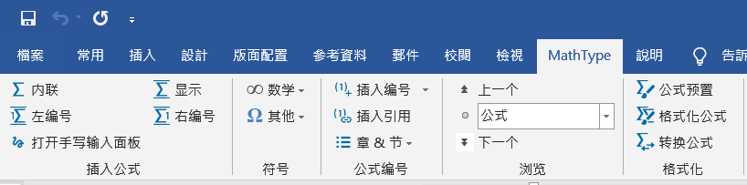
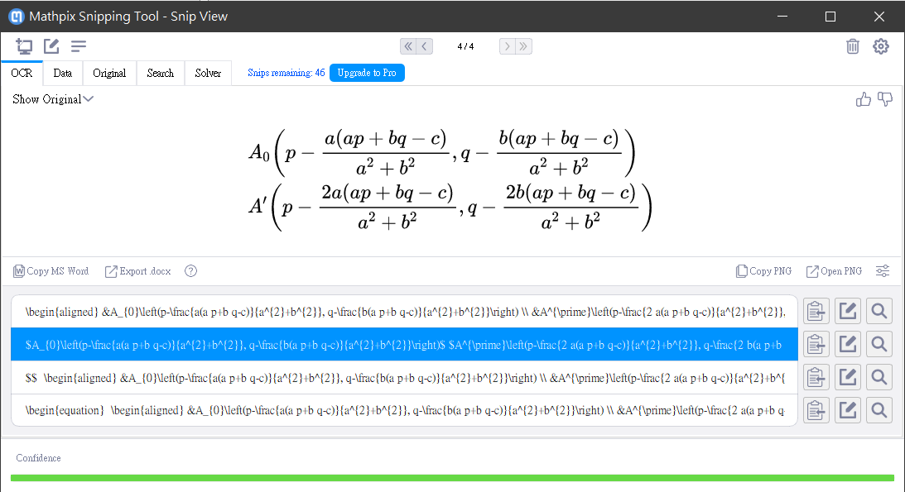
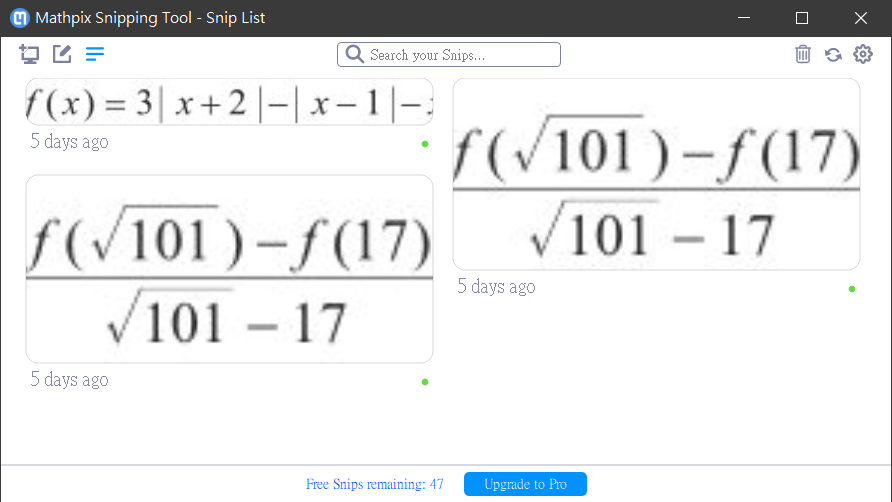
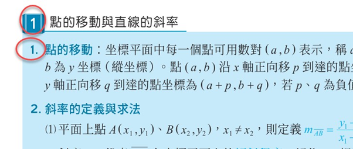

# 數學教材點譯筆記

**前言**：本文是筆者轉譯數學教材給視障生的個人心得筆記。我希望能夠有一份比較完整的文件，可供未來投入此工作的朋友參考，省去一些自行摸索的時間。如有疏漏或謬誤之處，歡迎提出建議和指正，讓這份文件更加完善。

目標讀者：需要製作數學點譯教材的人，而且很大程度需要視覺。

本文最後更新日期：2021.9.26

底下是本文所提到的相關軟體的名稱與版本：

- Microsoft Office 2016
- WIRIS MathType 7.4.8.0
- Mathpix Snipping Tool 03.00.0048

**內容大綱：**

1. 來源檔案格式
2. MathType 筆記
3. 輔助工具：Mathpix Snip
4. 項目編號與符號
5. 小節標題的編號
6. 填空題的空格應如何表現？
7. 其他符號與注意事項
8. 從 DOCX 轉換成 HTML
9. 結語

以下開始正文。

## 來源檔案格式

來源檔案格式：DOCX 或 PDF。

PDF 的問題：有些中文字從 PDF 轉貼或轉存至純文字檔案時，會變成亂碼。而且，同一個檔案，有些文字可順利取出，有些則取出後變成亂碼，推測可能是製作 PDF 的時候，對某些文字使用了特殊的字元編碼。

基於上述原因，在進行教材點譯工作時，如果來源檔案格式為 DOCX 檔案是最好的，可以省下一些枝枝節節的麻煩。然而，依教材出版商而定，還是難免碰到只有 PDF 檔案的情況。因此，點譯工作者除了要熟悉 Word 文件的編輯功能，同時也要了解 PDF 檔案的一些特性與文件處理技巧。比如說，某些 PDF 可能是以圖片來呈現大量文字，此時便可能會需要使用螢幕擷取工具來將 PDF 文件中的某個區塊抓圖存檔，再丟給 Google 文件來進行文字辨識，以便取出其中的文字。

## MathType 筆記

這裡不會介紹 MathType 的詳細用法，僅記錄我在使用 MathType 時發現的一些心得與技巧。

1. 如上圖，MathType 工具列的左邊有「內聯」和「顯示」按鈕，這兩個按鈕都可以開啟 MathType 編輯器，二者的差異是：使用「內聯」所輸入的公式會與前後文字緊密結合，而使用「顯示」按鈕來輸入的數學公式則會自成單獨一列，與前後文字隔開。我最常使用的是「內聯」，快速鍵是 Ctrl+Alt+Q。
2. 在 MathType 編輯器當中輸入好公式之後，按 Ctrl+S即可將公式傳送至 Word 文件中游標所在的位置，接著請按 Ctrl+F4 或以滑鼠點擊編輯視窗右上角的打叉按鈕來關閉MathType 編輯器，而不要使用 Alt+F4 來關閉 MathType 編輯器。因為一旦使用 Alt+F4 來關閉編輯器，下次開啟 MathType 編輯器的時候，會如同第一次開啟編輯器的時候那樣需要等候比較長的時間。
3. 使用 MathType 來輸入數學公式，最終無可避免地要學習一些 LaTeX 語法。所以必須知道 MathType 的一個快速鍵：Alt+\（即 Alt+反斜線）。每當按下 Alt+\，MathType 便會將游標所在的數學公式轉換為一串 LaTeX 標記文字，再按一次則又會轉換成 MathType 數學公式物件。
4. 就我個人的經驗，MathType 手寫公式的辨識功能幫助很有限，因為辨識結果的正確率很大程度取決於手寫的公式是否容易辨認。即使有繪圖板的輔助，還是很難達到理想的生產力。我的經驗是，在繪圖板上寫下歪歪斜斜的公式，其中一些上標或下標的符號辨識錯誤，又得擦掉重寫一次。如此反覆擦掉重寫，還不如使用 MathType 本身提供的現成公式符號並且搭配 LaTeX 來輸入，或者搭配接下來介紹的辨識工具 Mathpix Snip 來輔助，更有助於提高生產力。

## 輔助工具：Mathpix Snip

除了 MathType 之外，對於比較複雜，或不知道如何輸入的數學公式，可以利用一個叫做 Mathpix Snip 的辨識軟體。有關此工具的用法，可以先看一下「視覺障礙輔助科技筆記本」網站的文章：簡介 Mathpix Snip 數學式 OCR 工具。

此工具是付費軟體，但有提供免費會員每個月 50 次辨識。我實際使用之後，覺得很有幫助，對於複雜的數學公式，只要原始圖片中的公式清晰可辨，幾乎可說不費吹灰之力，辨識的正確率相當高。透過此工具直接取得 LaTeX 標記之後，只要貼到 Word 文件中，就能夠轉換成 MathType 公式（按 Alt+\ 可以在 LaTeX 和 MathType 公式物件之間來回切換）。

雖然免費版有每個月辨識 50 次的上限，但是我們在製作數學文件時，其實有許多公式是很相似的。對於比較複雜的數學公式，只要用 Mathpix Snip 轉換一次，變成 MathType 公式之後，未來碰到類似的公式，其實只要從先前輸入過的 MathType 公式複製一份，再做修改即可。如此一來，每個月辨識 50 次的限制也許還是相當夠用的。

Mathpix Snip 包含一個 Windows 應用程式，叫做 Mathpix Snipping Tool。有需要辨識數學公式的時候，就是用這個工具來指定要辨識的螢幕區塊。參考下圖，是筆者某次執行辨識的螢幕截圖：

辨識結果呈現在視窗下方，而且有四種格式可以選擇。四種格式都是 LaTeX 語法，只在排版樣式方面有些許差異。實際用過幾次之後，你就會知道哪一種格式比較符合你的需求。

每次打開此工具的視窗時，它會顯示最近曾經辨識的公式，而視窗下方也會顯示目前還有幾次免費辨識可以使用。如下圖：

## 項目編號與符號

建議：取消 Word 自動編號與自動項目符號。

理由：如果使用 Word 自動編號，在執行 MathType 的轉換功能來將數學公式物件轉換成 MathML 標籤時，可能會在 MathML 標籤裡面出現大量的數字編號，而這些多餘的編號將導致無效的 MathML 標籤（也就是說，瀏覽器會無法辨識這些數學公式）。

如果您正在編寫若已經編寫完成的文件裡面已經有使用 Word 自動編號，可透過底下的巨集指令來自動將整份 Word 文件中的自動編號格式去除，僅保留文字的部分：

~~~~~~~~
Sub 自動編號轉文字()

Dim listItems As List
    For Each listItems In ActiveDocument.Lists
        listItems.ConvertNumbersToText
    Next

End Sub
~~~~~~~~

上面的巨集指令只針對項目編號，而沒有處理項目符號。碰到項目符號的時候，有的人可能只是把項目符號刪掉，但如此一來，就失去了項目符號原本的排版用意，可能導致閱讀時分不清到底哪些文字是屬於同一個相關的項目。因此，我認為碰到 Word 項目符號的時候，可以改用半形的星號來取代（也就是 * 字元）。Markdown 語法也是以此方式來表現項目清單，故可視為一種較為通用的純文字表現方式。

## 小節標題的編號

有些文件在排版時僅透過字體大小來區別標題層次，轉譯時如果沒有做一些調整，對視障生容易造成誤解。如下圖：

圖中緊鄰的兩列文字，開頭的 1 都是標號，一個是大標，下一個則是次標，如果直接貼到純文字檔案，內容會是：

~~~~~~~~
1 點的移動與直線的斜率
1. 點的移動：坐標平面中每一個點....（略）
~~~~~~~~

明眼人可以透過字型大小來區別大標與小標，但視障生聽到報讀軟體連續兩行都念 "1"，有可能會覺得奇怪，甚至覺得可能是點譯人員打錯字。

一個可能的處理方式，是把大標的標號 1 改用國字一並加上頓號，結果會變成：

~~~~~~~~
一、點的移動與直線的斜率
1. 點的移動：坐標平面中每一個點....（略）
~~~~~~~~

另一個可能考慮的作法，是採用 Markdown 的標記語法，也就是用 # 符號來表示標題層次：一個 # 開頭的文字代表一級標題，兩個 # 開頭的文字代表二級標題，依此類推。以剛才的例子來說，會寫成這樣：

~~~~~~~~
#1. 點的移動與直線的斜率
##1. 點的移動：坐標平面中每一個點....（略）
~~~~~~~~

這種額外附加 # 符號的做法，只是筆者個人曾經考慮的作法，實務上未曾用過，因為這還得考慮讀者是否能接受的問題。

總之，前述有關標號層次的問題與建議，最終還是得依使用者的接受度來決定，只要不會造成閱讀時的混淆與誤解就行了。

## 其他符號與注意事項

本節整理一些數學符號的注意事項。包括：三角形符號、比值、填空題的空格表現方式、多餘的空白等等。

### 三角形符號

三角形符號應使用 △，而不是 ∆，二者看起來很像，輸入的時候時容易搞錯。如果使用了正確的 △ 符號，則無論有沒有包在數學區塊中，NVDA 都能唸出「三角形」。如果使用了另一個符號 ∆， 在我的作業環境上，NVDA 會唸「遞增」或「變化量」。

### 比值

建議使用數學標記來表示比值。例如「四比五比三」，如果使用一般的半形或全形冒號來表示，例如 4:5:3，在我的環境下，NVDA 碰到冒號會直接跳過，沒有唸出來，此時必須按 NVDA+P 來提高 NVDA 的「符號等級」，才會唸出冒號。如果有包在數學區塊裡，則無論 NVDA 符號等級是什麼，都能夠唸出「冒號」。

### 填空題的空格應如何表現？

考券上面的填空題，在需要學生填寫答案的地方，視覺上經常是以特定長度的底線來呈現。轉譯時，這個部分可以改成一對半形的括弧，左右括弧中間可以加一個空白字元，像這樣：( )。

### 有些多餘空白必須刪除

數學式子當中有些多餘空白必須刪除，參考底下的範例：

範例一：線型函數 f ( x ) = - 1899x + 21950

範例二：座標 ( 10 , - 2 )

上述兩個範例，由於原始教材檔案裡面就有安插多餘的空白符號，使得負數的負號也跟其關連的數字當中隔了一個空白字元。像這種情形，在點譯時應該要把負號與數字之間的多於空白字元刪除，以免造成閱讀時的誤解。

## 從 DOCX 轉換成 HTML

在 Word 裡面完成所有的文字編輯工作之後，通常還要轉換成 HTML 檔案，以便視障者可以透過瀏覽器搭配 NVDA 與 Access8Math 語音來閱讀這份文件（包括文件中的數學公式也要能正確報讀）。

有關 DOCX 轉換成 HTML 的操作，可以參考「視覺障礙輔助科技筆記本」網站上的這篇文章：[MathType 轉 MathML 製作流程筆記](https://class.kh.edu.tw/19061/bulletin/msg_view/238)。由於該文已經包含所有必要的操作步驟，這裡就不重複說明，僅針對其中一些注意事項與細節差異整理如下：

1. 利用 Word 取代功能將換行記號 ^p 取代為  ^p，此步驟要先做，然後才能進行 MathType 的公式轉換。如果順序互換，將破壞已經轉好的 MathML 標記。

2. 執行 MathType 的公式轉換功能時，我選擇的文字轉換器是「MathML 3.0 (no  namespace）」，而不是 MathML 2.0。我並不清楚版本之間有何差異，只是習慣選擇比較新的版本而已。

3. 貼到記事本之後，我會在文件開頭加上 “<html><body>”，並於文件結尾附加 “</body></html>”。此步驟並不是絕對需要，只是盡量讓這份文件更符合 HTML 網頁標準而已。

## 結語

日後若有其他心得或新發現，我會陸續整理到這份文件。如果您發現有值得補充的地方，或文中描述有錯誤的地方，歡迎留言讓我知道，好讓我持續完善這份文件。我的電子郵件信箱是 huanlin.tsai@gmail.com。

## 參考資料

- [MathType 轉 MathML 製作流程筆記](https://class.kh.edu.tw/19061/bulletin/msg_view/238)
- [簡介 Mathpix Snip 數學式 OCR 工具](https://class.kh.edu.tw/19061/bulletin/msg_view/598)
